# DDR Controller for Cyclone II

# Vorbereitung
* Micron MT46V16M16TG-6T zu altera/13.0sp1/ip/altera/ddr_ddr2_sdram/constraints/memory_types.dat hinzufügen. 
Siehe [memory_types.dat](./ddr_ctl_dokumentation/memory_types.dat)  
Alternativ: Micron MT46V16M16TG-5B verwenden. 

* dq[15:] ist an Bank 4 angeschlossen, das lässt sich aber nicht in Megawizard auswählen.
Deswegen eine Bank 4TL zu altera/13.0sp1/ip/altera/ddr_ddr2_sdram/constraints/dat/ep2c35_f484_x8_v02.dat hinzufügen. 
Siehe [ep2c35_f484_x8_v02_4TL.dat](./ddr_ctl_dokumentation/ep2c35_f484_x8_v02_4TL.dat) 
altera/13.0sp1/ip/altera/ddr_ddr2_sdram/constraints/dat/ep2c35_f484_x8_floorplan_v00.dat ändern: 
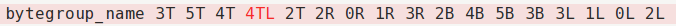 

# Projekt erstellen
Folge Altera Application Note 380 [Test DDR or DDR2 SDRAM Interfaces on Hardware Using the Example Driver] 
* Erstelle Quartus Project 
* Tools→Megawizard Plugin Manager→Create a new custom megafunction variation→DDR SDRAM Controller v13.0 
* Parameterize  
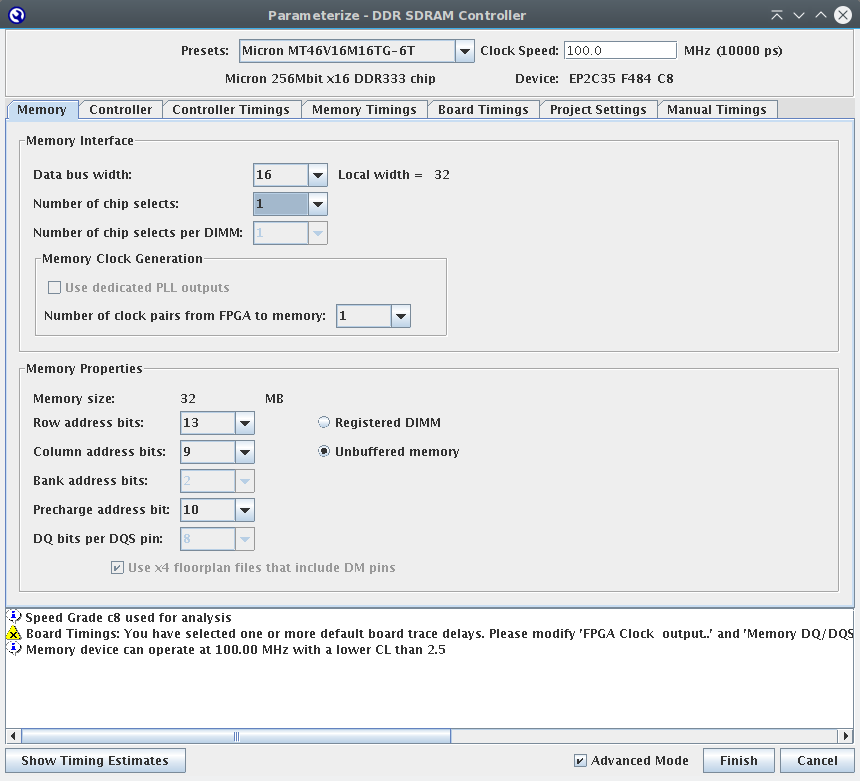 
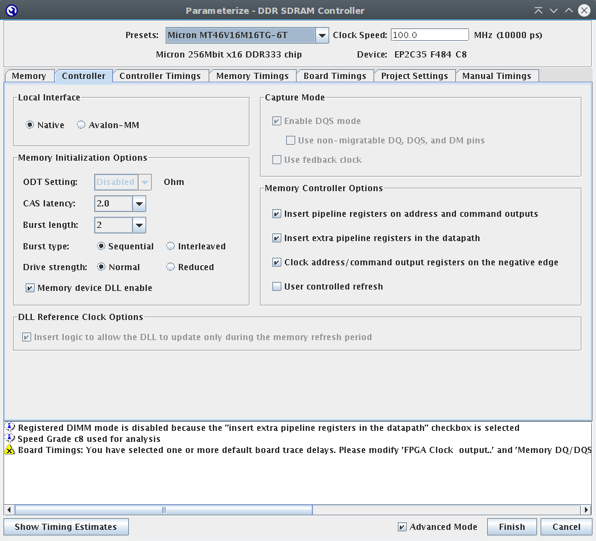 
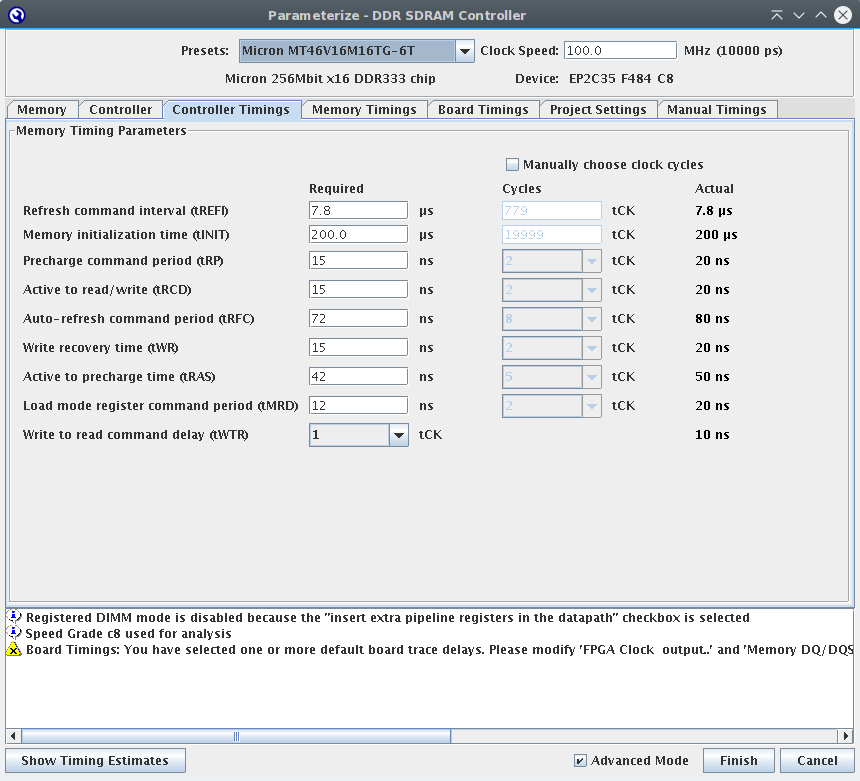 
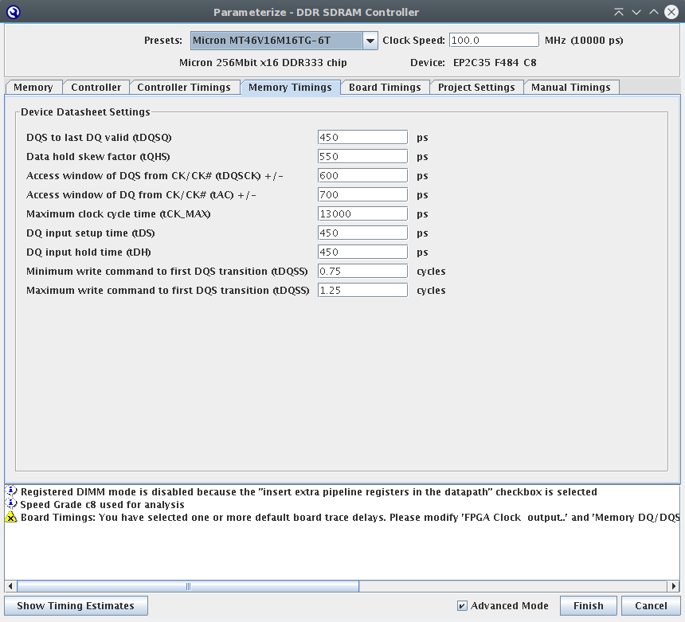 
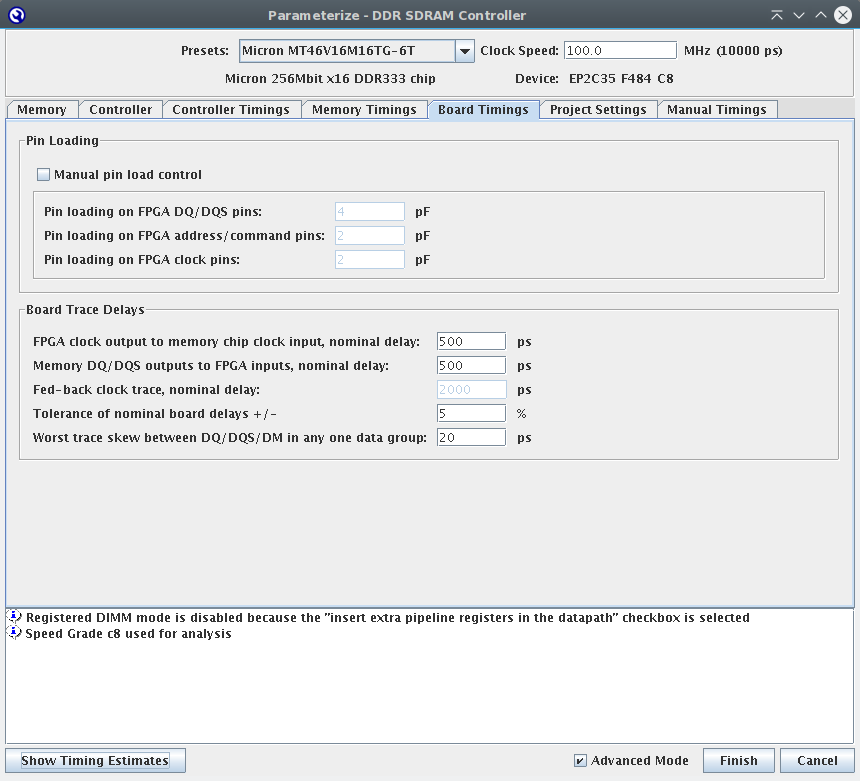 
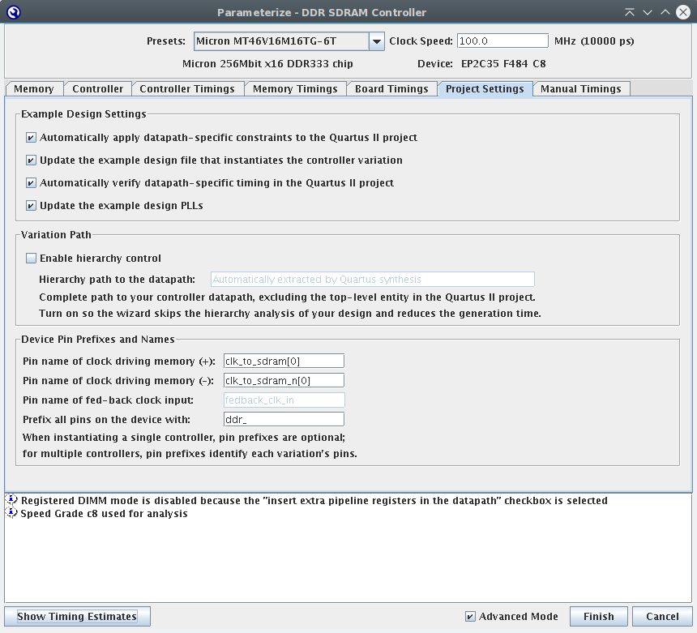 
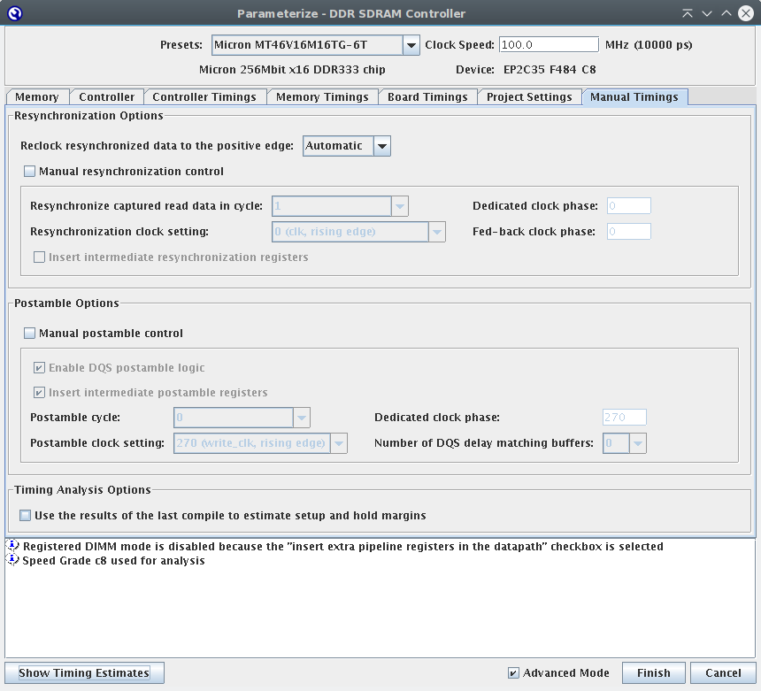 

* Constraints  
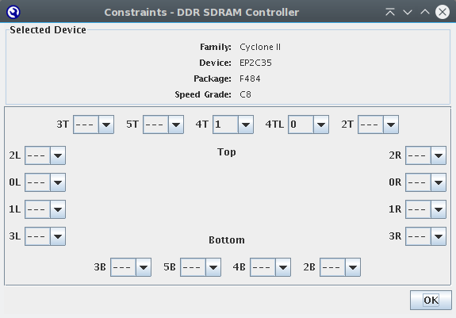 

* ddr_proj.vhd zum Projekt hizufügen  
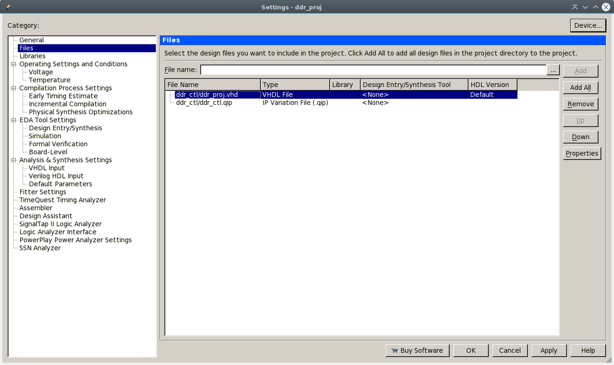 

* PLL ändern  
Tools→Megawizard Plugin Manager→Edit an existing custom megafunction variation  
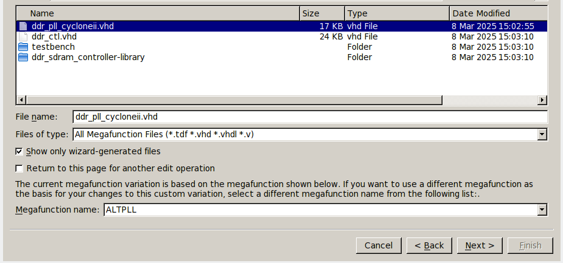 
Frequenz auf 25 Mhz stellen→Finish→Finish 
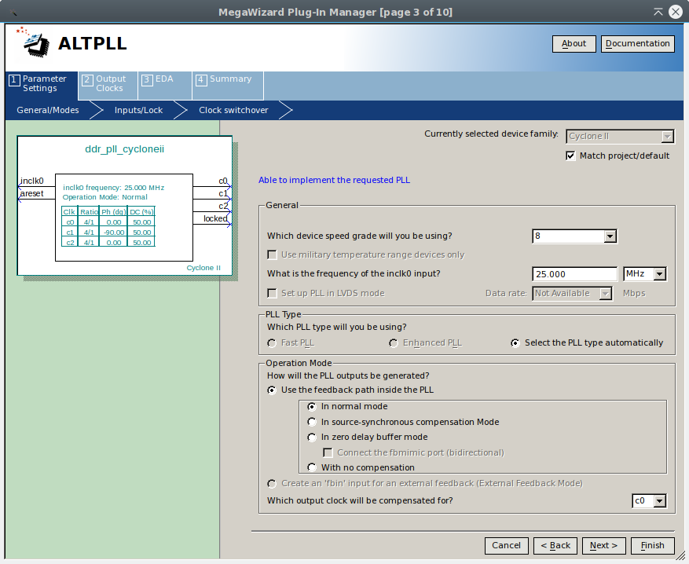 
* Pins einstellen 
Tools→Tcl Scripts… → ddr_proj.tcl 
# Literatur
* Datenblatt Micron MT46V16M16 – 4 Meg x 16 x 4 banks
* Altera Application Note 380 Test DDR or DDR2 SDRAM Interfaces on Hardware Using the Example Driver
* Altera Application Note 361 Interfacing DDR & DDR2 SDRAM with Cyclone II Devices
* Altera Cyclone II Device Handbook, Volume 1 Chapter 9. External Memory Interfaces

