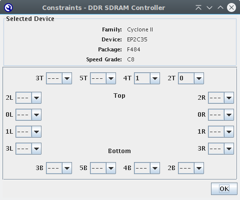

# DDR Controller for Cyclone II   (Cisco-HWIC-3G board) 
english version below

# Vorbereitung
* Micron MT46V16M16TG-6T zu altera/13.0sp1/ip/altera/ddr_ddr2_sdram/constraints/memory_types.dat hinzufügen. 
Siehe [memory_types.dat](./ddr_ctl_dokumentation/memory_types.dat)  
Alternativ: Micron MT46V16M16TG-5B verwenden. 

# Projekt erstellen
Folge Altera Application Note 380 [Test DDR or DDR2 SDRAM Interfaces on Hardware Using the Example Driver] 
* Erstelle Quartus Project 
* Tools→Megawizard Plugin Manager→Create a new custom megafunction variation→DDR SDRAM Controller v13.0 
* Parameterize  
 
 
 
 
 
 
 

* Constraints  
 

* ddr_proj.vhd zum Projekt hizufügen  
 

* PLL ändern  
Tools→Megawizard Plugin Manager→Edit an existing custom megafunction variation  
 
Frequenz auf 25 Mhz stellen→Finish→Finish 
 
* Pins einstellen 
Tools→Tcl Scripts… → ddr_proj.tcl 

# SignalTap 
 
Signal pnf_per_byte sollte `Fh` sein. 

Für SignalTap TalkBack aktivieren 
Tools→Options→Internet Connectivity→TalkBack Options 
Haken bei "Enable sending TalkBack data to Altera", auf OK klicken 
Auf OK klicken 

# Literatur
* Datenblatt Micron MT46V16M16 – 4 Meg x 16 x 4 banks
* Altera Application Note 380 Test DDR or DDR2 SDRAM Interfaces on Hardware Using the Example Driver
* Altera Application Note 361 Interfacing DDR & DDR2 SDRAM with Cyclone II Devices
* Altera DDR and DDR2 SDRAM Controller Compiler User Guide
* Altera Cyclone II Device Handbook, Volume 1 Chapter 9. External Memory Interfaces

# English version

# Preparations
* Add Micron MT46V16M16TG-6T to altera/13.0sp1/ip/altera/ddr_ddr2_sdram/constraints/memory_types.dat. 
See [memory_types.dat](./ddr_ctl_dokumentation/memory_types.dat)  
Or use Micron MT46V16M16TG-5B. 

# Create project
Just follow Altera Application Note 380 [Test DDR or DDR2 SDRAM Interfaces on Hardware Using the Example Driver] 
* Create Quartus project 
* Tools→Megawizard Plugin Manager→Create a new custom megafunction variation→DDR SDRAM Controller v13.0 
* Parameterize  
 
 
 
 
 
 
 

* Constraints  
 

* Add ddr_proj.vhd to project 
 

* Change PLL 
Tools→Megawizard Plugin Manager→Edit an existing custom megafunction variation  
 
Set frequency 25 Mhz→Finish→Finish 
 
* Set Pins 
Tools→Tcl Scripts… → ddr_proj.tcl 

# SignalTap 

 
Signal pnf_per_byte should be `Fh`. 

Aktivate TalkBack for SignalTap 
Tools→Options→Internet Connectivity→TalkBack Options 
Check "Enable sending TalkBack data to Altera", click OK 
Click OK 
Auf OK klicken 

# Literature
* Datenblatt Micron MT46V16M16 – 4 Meg x 16 x 4 banks
* Altera Application Note 380 Test DDR or DDR2 SDRAM Interfaces on Hardware Using the Example Driver
* Altera Application Note 361 Interfacing DDR & DDR2 SDRAM with Cyclone II Devices
* Altera DDR and DDR2 SDRAM Controller Compiler User Guide
* Altera Cyclone II Device Handbook, Volume 1 Chapter 9. External Memory Interfaces

